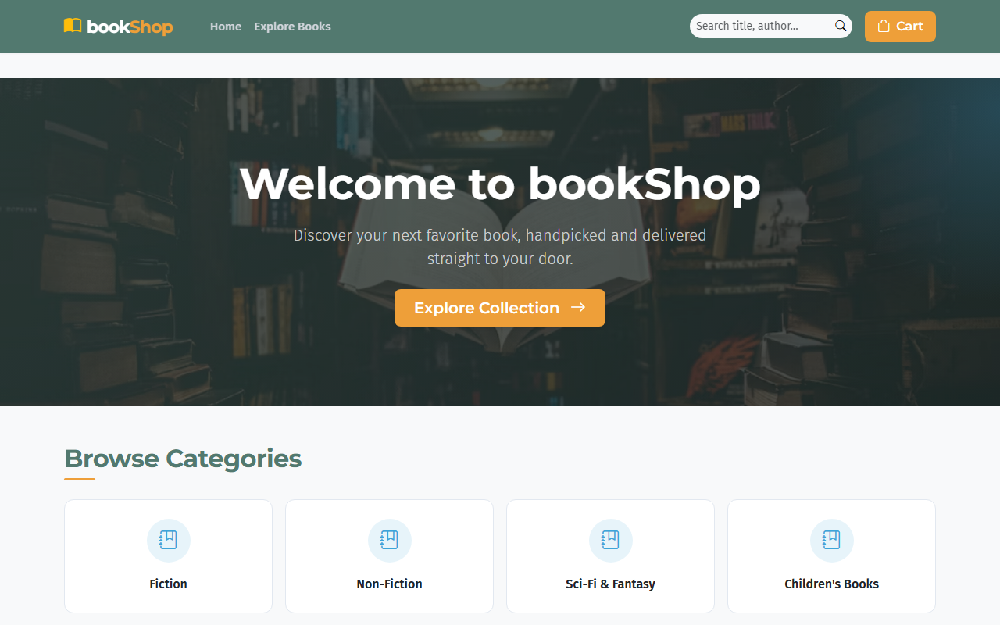
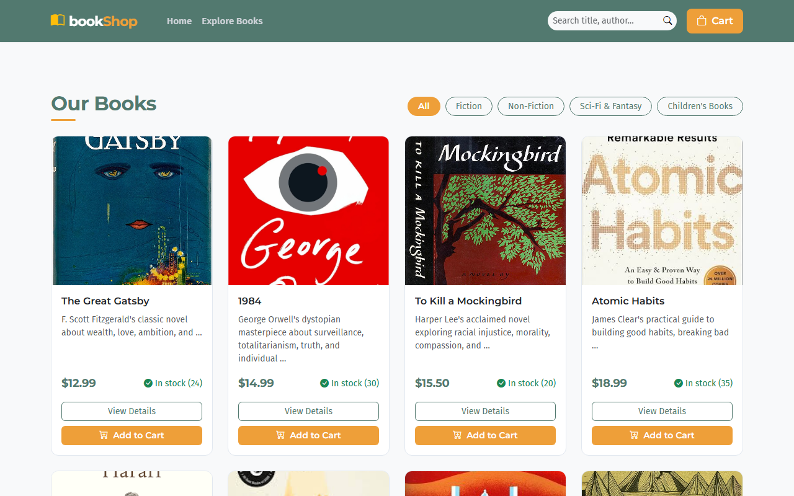
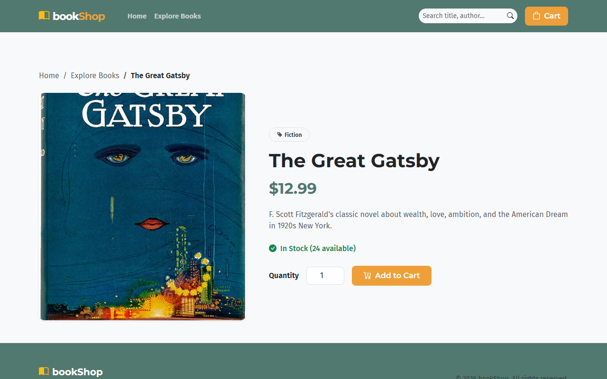
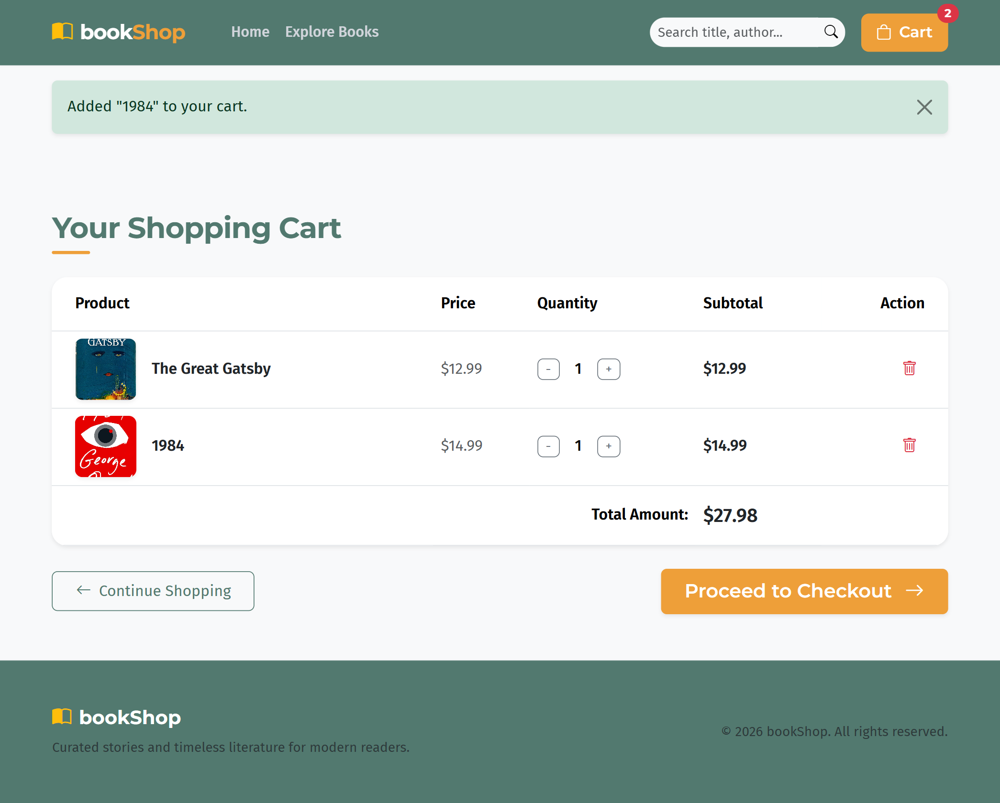
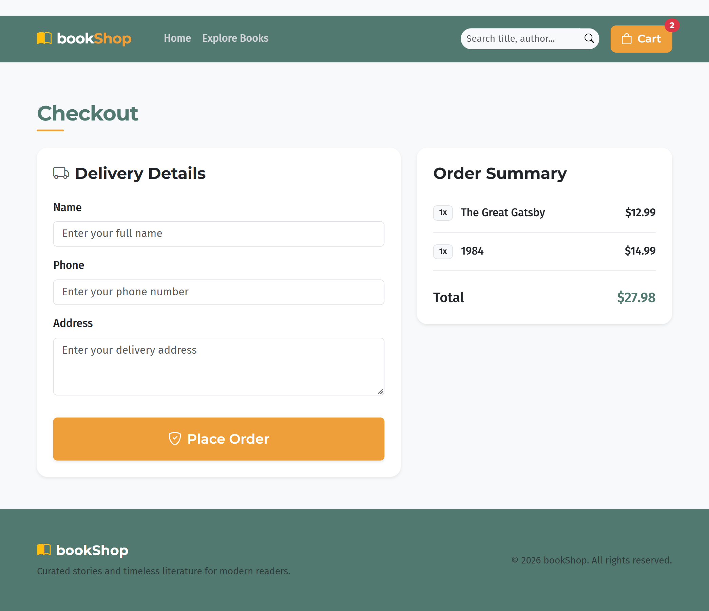

# bookShop — Single Vendor Book Shop (Django)

[](https://mehdihossenfahim.pythonanywhere.com/)

A simple single-vendor e-commerce website for an online **Book Shop**, built with Django,
HTML, CSS, JavaScript and Bootstrap 5. Built as a course assignment to practice Django
views, templates, models, URL routing, forms, and database operations.

## Features

- **Home page** — shop branding, navbar, hero banner, category grid, featured products, footer
- **Product listing** — all books loaded from the database, with category filter and search
- **Product details** — image, name, price, full description, available stock, add-to-cart
- **Shopping cart** (session-based) — add, increase/decrease quantity, remove, live total
- **Checkout** — customer name/phone/address form, saves the order to the database
- **Order success** page confirming "Order Placed Successfully!"
- **Django Admin** — manage categories, products, customers and orders
- Responsive Bootstrap 5 layout with custom CSS theming
- JavaScript for cart quantity feedback, quantity-input validation, and checkout form validation

## Screenshots

|                                                                             **Home Page**                                                                              |                                                                         **Product Listing**                                                                          |
| :--------------------------------------------------------------------------------------------------------------------------------------------------------------------: | :------------------------------------------------------------------------------------------------------------------------------------------------------------------: |
|                  |  |
|                                                                          **Product Details**                                                                           |                                                                          **Shopping Cart**                                                                           |
|  |     |
|                                                                           **Checkout Page**                                                                            |                                                                                                                                                                      |
|          |                                                                                                                                                                      |

## Tech Stack

- Python / Django 6.1
- SQLite (default Django database)
- Bootstrap 5 + Bootstrap Icons
- Vanilla JavaScript

## Project Structure

```
ecommerce_project/      # Django project settings, root URLs
shop/                   # Main app: models, views, urls, admin, cart logic
  management/commands/  # seed_data command with sample books
  migrations/
templates/shop/         # All HTML templates (base, home, products, product_detail,
                         # cart, checkout, order_success)
static/
  css/style.css
  js/cart.js
media/                  # Uploaded product images (created at runtime)
requirements.txt
manage.py
```

## Models

- **Category** — name, slug
- **Product** — name, category, price, description, image, quantity, is_featured
- **Customer** — name, phone, address
- **Order** — customer (FK), product (FK), quantity, total_price, order_date

## Setup & Run Locally

1. **Clone the repository**

   ```bash
   git clone https://github.com/username/single-vendor-ecommerce.git
   cd single-vendor-ecommerce
   ```

2. **Create a virtual environment & install dependencies**

   ```bash
   python -m venv .venv
   source .venv/bin/activate   # On Windows: .venv\Scripts\activate
   pip install -r requirements.txt
   ```

3. **Run migrations**

   ```bash
   python manage.py migrate
   ```

4. **(Optional) Seed sample books**

   ```bash
   python manage.py seed_data
   ```

5. **Create an admin account**

   ```bash
   python manage.py createsuperuser
   ```

6. **Run the development server**

   ```bash
   python manage.py runserver
   ```

7. Visit:
   - Storefront: http://127.0.0.1:8000/
   - Admin panel: http://127.0.0.1:8000/admin/

## Managing Products

Add, edit, and remove books (with images, price, stock, and featured flag) through the
Django Admin panel at `/admin/`.

## Notes

- The shopping cart is stored in the Django session (no login required to shop).
- Placing an order creates one `Order` row per cart line item, reduces the matching
  product's stock, and clears the cart.

## Bonus Features Implemented

- Product search (by name/description)
- Category filter

## Author

- Mehedi Hossen Fahim
